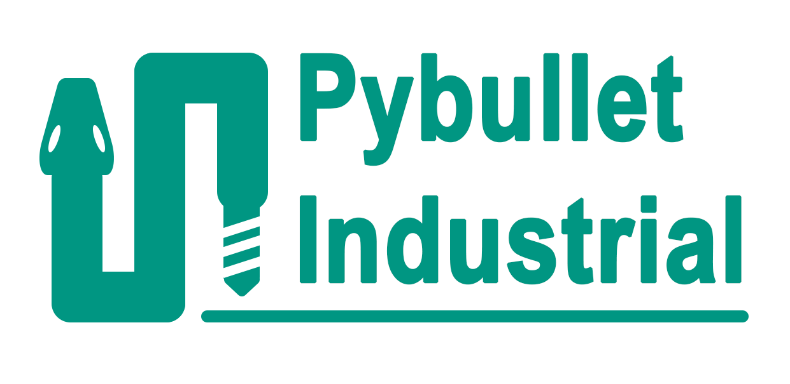

[](https://zenodo.org/badge/latestdoi/491020827)
[](https://codecov.io/gh/WBK-Robotics/pybullet_industrial)
[](https://app.codiga.io/project/34121/dashboard)
[](https://pybullet-industrial.readthedocs.io/en/latest/?badge=latest)


Pybullet_industrial is a process-aware robot simulation.
It aims to enable scientists and researchers to easily simulate robotics scenarios where a robot is participating in a manufacturing process.
It achieves this by combining the world of classical robot simulations with the world of industrial processes.
The library is capable of simulating different manufacturing tools and workpieces, as well as the robot itself.
With the help of the pybullet_industrial package you will be able to:

- simulate additive manufacturing processes
- simulate milling processes and how the resulting forces impact the robot
- simulating paint coating scenarios
- simulate the handling of complex tasks using a variety of grippers


## Getting Started

There are two ways to get started with the library. The first is to use the newest source version from the repository.
The second is to use the latest release version from pip. The source version is the most up-to-date, but it is also the most unstable.
The release version is the most stable, but it is also the least up-to-date.
The release version is recommended for most users, but the source version is recommended for developers.


### Getting started with the release version

The release version is the most stable version of the library. It is recommended for most users. To install the release version, run the following command:

```
pip install pybullet_industrial
```

### Getting started with the source version

The source version is the most up-to-date version of the library. It is recommended for developers. To install the source version from the repository, run the following commands:

```
    git clone https://github.com/WBK-Robotics/pybullet_industrial
    cd pybullet_industrial
    pip install src/
```

Note that if you are on windows, you may need to use the command `pip install src\\` instead.


