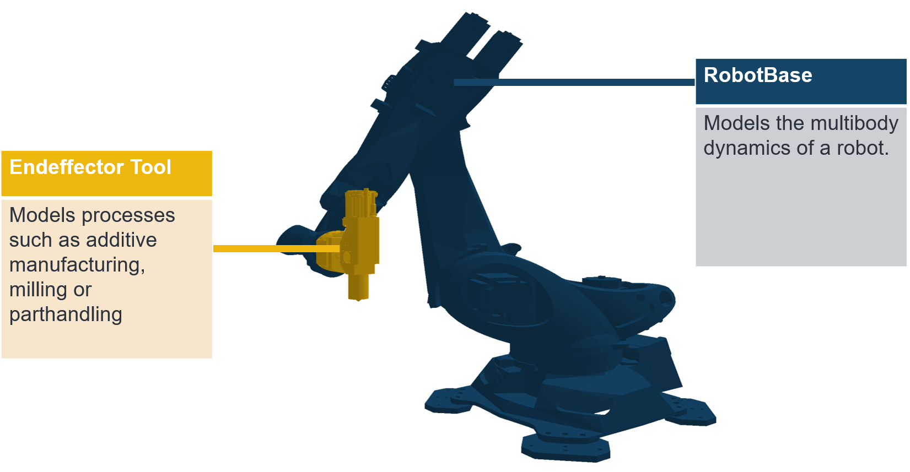
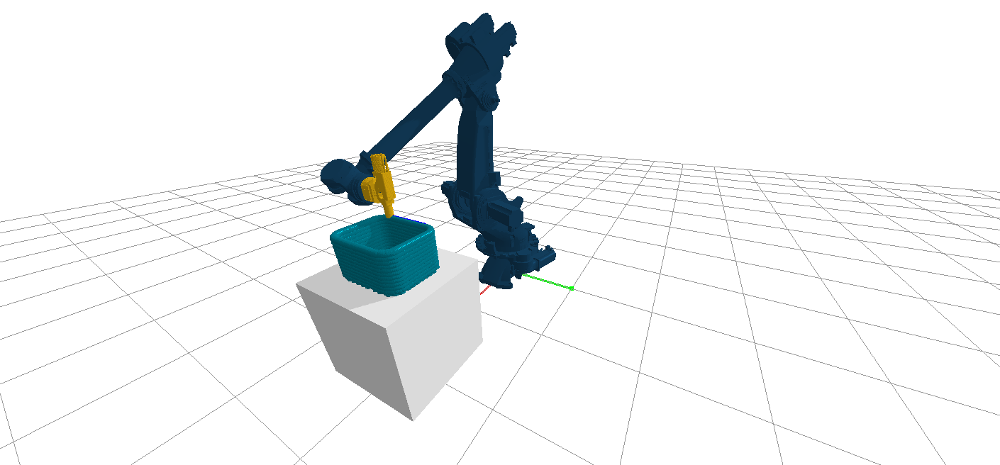
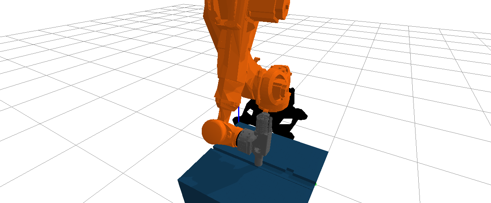
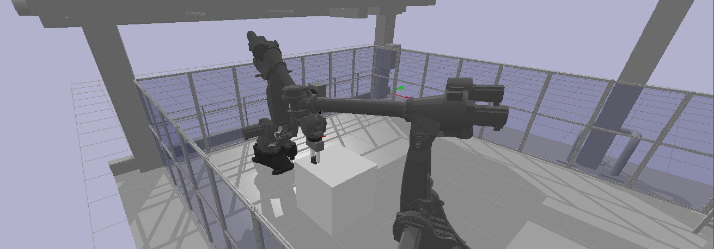
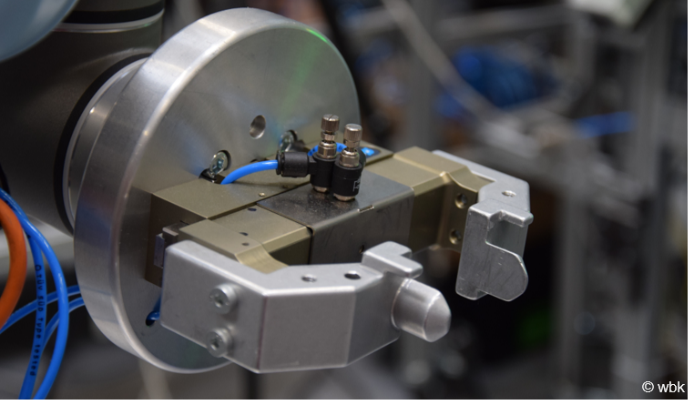
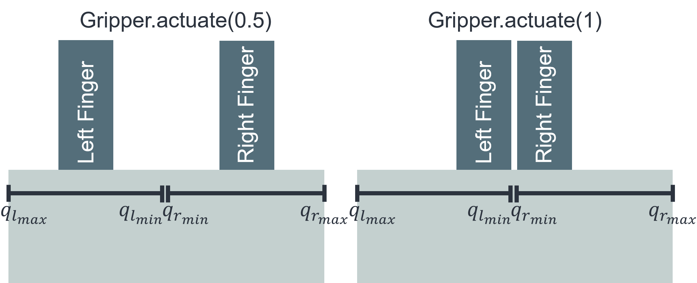
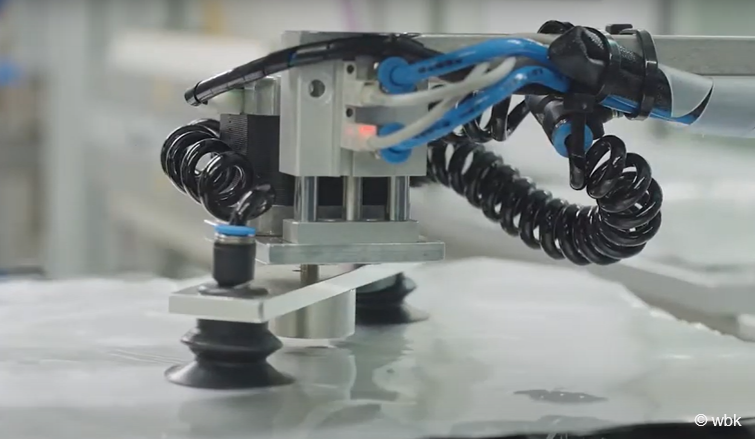
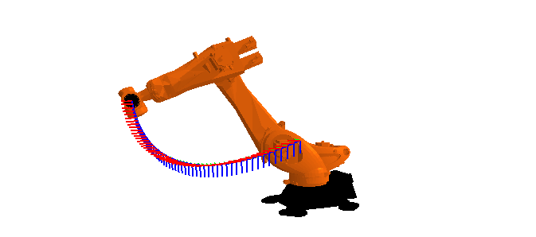

#################
Using the Package
#################

This page describes the general design of the classes and functions in this package to enable users to use the package to its full potential.  The package is designed to be used in a variety of ways, and the following sections describe the different ways in which the package can be used.
The aim of pybullet_industrial was to merge the worlds of process simulations and multibody robot simulations by providing a combined solution with reasonable performance in both domains.
The main robot simulation functionality is provided by a dedicated Robot object called :class:`RobotBase`, while the process is simulated by a class called :class:`EndeffectorTool`.
Speaking plainly, this means that robot tools encapsulate the various manufacturing processes.

The following sections will dive deeper into the robot and endeffector objects and detail how they can be used to simulate manufacturing scenarios.

Note that the pybullet_industrial package is meant to be used in conjunction with pybullet.
Its objects are designed to be used within pybullet's simulation loop, and the package is not meant to be used as a standalone simulation package.
An example of how to use the package can be found in the GitHub repository `example directory<https://github.com/WBK-Robotics/pybullet_industrial/tree/main/examples>`_  and is repeated below:

.. literalinclude:: ../../examples/orientation_ctr.py
   :language: python
   :linenos:

#############
Robot objects
#############

Robot objects are one of the main objects in the package. Their main purpose is to load a dynamic robot simulation into a pybullet simulation and provide a set of functions to control the robot and get information about the robot's state.
The pybullet_industrial package provides a class called :class:`RobotBase` that can be used to load a robot from a UDF (universal robot description file) file and interact with it.
A robot in this case means a robot manipulator, that is to say, a stationary robot with a fixed base and a number of joints that can be actuated.

****************
Joint interfaces
****************

pybullet_industrial provides interfaces for setting and measuring the state of these joints. The state of a single joint is a dictionary containing the following keys:

- position: the current position of the joint (in radians for revolute and meters for prismatic joints)
- velocity: the current velocity of the joint (in radians per second for revolute and meters per second for prismatic joints)
- reaction force: the current reaction force of the joint (in Newtons)
- torque: the current effort of the joint (in Newtons for revolute and Newtons per meter for prismatic joints)

**********************
Endeffector interfaces
**********************

In industrial robotics one often does not care for the joint state of the robot, but rather for the state of the endeffector.

.. warning::
    The endeffector is the part of the robot that is attached to the end of the last joint and that is typically used to interact with the environment.
    But for the pybullet_industrial package interaction with the environment is handled by the :class:`EndeffectorTool` class. This means that the endeffector refers in this case to the end of the robot's flange.

The pybullet_industrial package provides interfaces for setting and measuring the state of the endeffector.
These interfaces make it possible to set the desired position and orientation of the endeffector and to measure the current position and orientation of the endeffector.
Note that providing the orientation is optional, in this case, the robot assumes an arbitrary rotation at a given position.

.. important::
    The orientation is given as a quaternion, which is a 4-tuple of floats.
    The first three elements of the tuple are the imaginary part of the quaternion and the last element is the real part.

*********************
Utility functionality
*********************

Apart from the joint and endeffector interfaces, the pybullet_industrial package provides some utility functionality.
These enable resetting the robot's state and moving the robot to a new position.
More information about these functions can be found in the Code documentation.

#################
Endeffector tools
#################

The endeffector tool is the main object for simulating processes in the pybullet_industrial package.
In robotic manufacturing, these processes can be grouped into three main categories:

- Adding Material (Such as welding, gluing, 3d printing, etc.)
- Removing Material (Such as milling, drilling, cutting, etc.)
- Moving Material (Such as moving a workpiece from one place to another)

Each of these process types is supported by a dedicated subclass.
The Base class still provides a lot of functionality common between all three types.

Like the :class:`RobotBase` object, the :class:`EndeffectorTool` is built using a URDF file.
This makes it easy to encapsulate the geometric description as well as the kinematic description in a single file.
Especially important is the tool center point (TCP) frame where all processes take place.
If not specifically provided during initialization, the last frame in the URDF file is assumed to be the tool center point frame.
Equally important is the so-called connector frame which is the frame that is used to attach the tool to the robot.
If not provided the base frame is used in this case.

*****************
Coupling the tool
*****************

The most important ability of a tool is to couple to a robot.
This attaches the connector frame of the tool to the endeffector of the robot.
This is done by providing the robot object to the :func:`EndeffectorTool.couple` function of the tool.
The tool will then attach itself to the endeffector of the robot and will be able to interact with the robot object.

.. important::
    The coupling is performed by creating a dynamic constraint between both bodies.
    This can sometimes cause problems where the solver has trouble converging resulting in the robot and the tool moving apart.
    This happens especially if the tool is pressing against another object.
    To prevent this from happening, the pybullet simulations number of solver iterations can be increased using the `p.setPhysicsEngineParameter(numSolverIterations=5000)` function.
    In practice values above 5000 seem to result in satisfactory behavior.

.. warning::
    The coupling immediately moves the tool to the endeffector of the robot.
    During the runtime of the simulation, this can impart significant momentum to the robot, which can lead to unexpected behavior.
    It is therefore advised to either connect the tool before starting the simulation or first move the endeffector to the position of the tool.
    The last option is the only possible way to dynamically switch tools in the real world anyway.

Tools can also be uncoupled from a robot, which will detach the tool and fix it in its current position.

***************
Moving the tool
***************

The tool can be moved to a new position and orientation using the :func:`EndeffectorTool.set_tool_pose` function.
If the tool is not coupled the tool is moved directly to the new position.
If coupled the inverse kinematics of the attached robot is automatically called and the robot moves the tool to the desired position.
The current position and orientation of the tool can be measured using the :func:`EndeffectorTool.get_tool_pose` function.
The orientation is again given as a quaternion.

**************
Applying force
**************

A lot of processes impart a dynamic force unto a tool and therefore a robot.
The :class:`EndeffectorTool` class, therefore, provides functionality to apply force and torque to the tool center point of the tool.
This force or torque vector can either be specified in local TCP coordinates or world coordinates.

***************
Adding material
***************

The :class:`Extruder` class is used to simulate processes that add material to a part.
Examples of such processes include 3d printing, welding, and coating.

The properties of the :class:`Extruder` can be grouped into two categories and are described in the extruder_properties dictionary.
These categories are:
- The extrusion pattern
- The material properties

Currently, the extrusion is performed in a cone-shaped pattern.
The cone is defined by the following properties:

- The opening angle of the cone (opening angle)
- The length of the cone (maximum distance)
- The number of extruded particles in the cone (number of rays)

.. image:: images/cone_shape.png
    :width: 60%
    :align: center
    :alt: cone_shape

When calling the :func:`Extruder.extrude` function the :class:`Extruder` will randomly sample rays inside the cone area equal to the number of extruded particles.
Each ray that hits an object will spawn a particle of the specified material.
See :ref:`materials_label` for more information about different types of materials and their properties which also have to be supplied to the :class:`Extruder`.

Note that the :class:`Extruder` supports dynamic changes of both the extruder pattern as well as the type and properties of materials.

.. important::

    By default the :class:`Extruder` does not feature any process force model.
    This means that the extrusion process will not apply any force to the tool center point of the tool.
    This is because the extrusion process is typically not dynamic.
    To still employ a process force model, the user can create their own child of the :class:`Extruder` class and override the :func:`Extruder.calculate_process_force` function.
    This function is called every time the :func:`Extruder.extrude` function is called and should return a force vector in world coordinates which is automatically applied to the TCP used for extrusion.

*****************
Removing material
*****************

Material removal is one of the most important manufacturing processes.
Since pybullet is by default a multi-body physics simulation, each removal process will delete a full object.
To accurately simulate material removal a simple voxel engine was added which is  described in the section :ref:`materials_label`
pybullet_industrial offers two classes for simulating material removal processes.

Remover
=======

The first class is the :class:`Remover` class. It is the twin of the :class:`Extruder` class and uses the same cone-shaped raycast.
But instead of adding material, it removes material from the environment.
The :class:`Remover` can be used to simulate processes such as laser cutting, sandblasting, or similar processes that work at range.

.. important::

    Like the :class:`Extruder`, the :class:`Remover` does not have a default force model.
    However like the :class:`Extruder` it is possible to create a child class and override the :func:`Remover.calculate_process_force` function.

Milling
=======

For material removal processes that require a tool to be in contact with the workpiece, the :class:`MillingTool` class can be used.
The class implements a cutting tool of configurable diameter and number of cutting teeth.
Each cutting tooth rotates around the z-axis of the tool center point and removes the material it touches.
This removal process creates a process force that acts on the tool center point.

For this package, the Kienzle force model was chosen whose formulation can be seen down below

.. image:: images/cutting_force.png
    :width: 80%
    :align: center
    :alt: cutting_force

Here the chip thickness exponent, as well as the material specific force, are dependent on the material being cut.
For this library these parameters are stored in the `milling_properties` dictionary of the :class:`MillingTool` class.
This means that people have to change these values manually in the tool when switching between materials.

.. TODO:: what are the default settings and what do they correspond to?

***************
Moving material
***************

Moving material using a robot is typically achieved using a gripper.
The pybullet_industrial package provides two classes for simulating grippers.

Finger Gripper
==============
The first class, called :class:`Gripper`, simulates finger grippers like the one pictured below.

The :class:`Gripper` class is initialized with a URDF file that describes the geometry of the gripper.
It can then be actuated using the :func:`Gripper.actuate` function which takes in input between 0 and 1.
0 corresponds to a closed gripper and 1 to an open gripper.
This relative input is then mapped to the joint limits of the gripper. The lower limit corresponds to a closed gripper and the upper limit to an open gripper.
An illustration using a two-finger gripper can be found below:

Suction Gripper
===============

The second class is called :class:`SuctionGripper` and simulates suction grippers like the one pictured below.

*******
Sensing
*******

Quality inspection applications often require the use of sensors to measure the state of the workpiece.
In the design philosophy of pybullet_industrial this can also be modeled as an :class:`EndeffectorTool`.
The package provides a simple :class:`Camera` class endeffector tool that can be used to simulate a camera.
Other complex sensors can be implemented similarly by subclassing the :class:`EndeffectorTool` class.

#########
Materials
#########

.. _materials_label:

Materials are implemented as particles with certain physical properties.
This includes their dimensions, mass as well as color.
The pybullet_industrial package provides a set of predefined materials that can be used to simulate different types of materials.
These are listed in the table below.

===================     =============================================================================================================================================================================
Name                    Description
===================     =============================================================================================================================================================================
:class:`Plastic`        simple particles which can be used for additive manufacturing. The particles are infinitely rigid and stick to each other.
:class:`Paint`          particles that stick to objects and move with them. The Paint particles are purely visible and have neither mass nor a collision mesh
:class:`MetalVoxel`     A simple voxel particle for cutting and milling simulations
===================     =============================================================================================================================================================================

Particles are typically spawned using a pybullet raycast result since they might not only require positions but also contact information about the body on which they are spawned.
To spawn particles or groups of particles directly at a given position the :func:`spawn_material_block` function can be used.

#########
Toolpaths
#########

Since much of the work when setting up a simulation does not involve the actual simulation itself but controlling the robot and specifying its path a :class:`ToolPath` class was set up to simplify this process.
A single :class:`ToolPath` object encapsulates a path for the robot's position, orientation as well as tool activation (that is to say if the tool is active at a given point of the path).
Using an iterator interface the :class:`ToolPath` can be iterated over to get the next position and orientation of the robot:

::

        for position, orientation, tool_active in :class:`ToolPath`:
            extruder.set_tool_pose(position, orientation)
            if tool_active:
                extruder.extrude()

:class:`ToolPath` objects can also be added together as well as easily translated rotated and drawn.
More information can be found in the code documentation.

A :class:`ToolPath` can be generated directly from points or several G-code-like interpolation functions.
A list of which can be found below:

- Linear interpolation :func:`linear_interpolation`
- Circular interpolation :func:`circular_interpolation`
- Spline interpolation :func:`spline_interpolation`

Additional functionality such as the build_box_path function can be used to generate more complex :class:`ToolPath` objects.

#####################
Utility functionality
#####################

The pybullet_industrial package also provides several utility functions that can be used to simplify working with simulations.
These include functions to draw points, paths, and coordinate systems as well as the ability to draw robot frames.
Additionally, the package provides functionality for selecting objects using the mouse.

