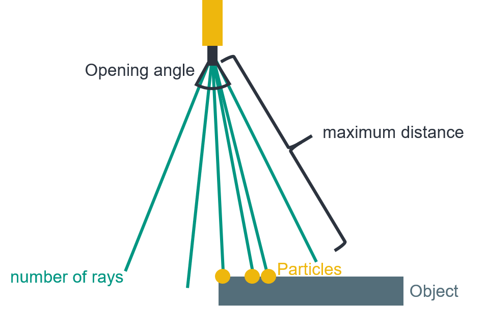
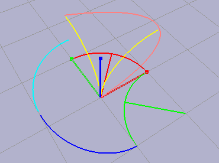

#################
Using the Package
#################

This page describes the general design of the classes and functions in this package to enable users to use the package to its full potential.  The package is designed to be used in a variety of ways, and the following sections describe the different ways in which the package can be used.
The aim of pybullet_industrial was to merge the worlds of process simulations and multibody robot simulations by providing a combined solution with reasonable performance in both domains.
The main robot simulation functionality is provided by a dedicated Robot object called RobotBase, while the process is simulation by a clas called EndeffectorTool.
Plainly speaking this means that robot tools encapsulate the various manufacturing processes.

The following sections will dive deeper into the robot and endeffector objects and details how they can be used to simulate manufacturing scenarios.

.. image:: images/robot_tool_overview.svg
    :width: 60%
    :align: center
    :alt: robot_tool_overview

*************
Robot objects
*************

Robot objects are on of the main objects in the package. There main purpose is to load a dynamic robot simulation into a pybullet simulation and provide a set of functions to control the robot and get information about the robot state.
The pybullet_industrial package provides a class called RobotBase that can be used to load a robot from a urdf (universal robot description file) file and to interact with it.
A robot in this case meaning a robot manipulator, that is to say a stationary robot with a fixed base and a number of joints that can be actuated.

Joint interfaces
----------------

pybullet_industrial provides interfaces for setting and measuring the state of these joints. The state of a single joint is a dictionary containing the following keys:

- position: the current position of the joint (in radians for revolute and in meters for prismatic joints)
- velocity: the current velocity of the joint (in radians per second for revolute and in meters per second for prismatic joints)
- reaction force: the current reaction force of the joint (in Newtons)
- torque: the current effort of the joint (in Newtons for revolute and in Newtons per meter for prismatic joints)

Endeffector interfaces
----------------------

In industrial robotics one often times does not care for the joint state of the robot, but rather for the state of the endeffector. 

.. warning::
    The endeffector is the part of the robot that is attached to the end of the last joint and that is typically used to interact with the environment. 
    But for the pybullet_industrial package interaction with the environment is handled by the EndeffectorTool class. This means that the endeffector refers in this case to the end of the robots flange.

The pybullet_industrial package provides interfaces for setting and measuring the state of the endeffector. 
These intertfaces make it possible to set the desired position and orientation of the endeffector and to measure the current position and orientation of the endeffector.
Note that providing the orientation is optional, in this case the robot assumes a arbitrary rotation at a given position.

.. important::
    The orientation is given as a quaternion, which is a 4-tuple of floats. 
    The first three elements of the tuple are the imaginary part of the quaternion and the last element is the real part.

Utility functionality
---------------------

Apart from the joint and endeffector interfaces the pybullet_industrial package provides some utility functionality.
These enable resetting the robots state and moving the robot to a new position.
More information about these functions can be found in the Code documentation.

*****************
Endeffector tools
*****************

The endeffector tool is the main object for simulating processes in the pybullet_industrial package.
In robotic manfucatuing theses processes can be grouped in three categories:

- Adding Material (Such as welding, gluing, 3d printing etc.)
- Removing Material (Such as milling, drilling, cutting etc.)
- Moving Material (Such as moving a part from one place to another)

Each of theses proceses types is supported by a dedicated subclass. 
The Base class still provides a lot of functionality common between all three types.

Like the RobotBase object, the EndeffectorTool is build using a urdf file.
This makes it easy to encapsulate the geometric description as well as the kinematic description in a single file.
Especially important is the the tool center point (tcp) frame where all processes take place.
If not specifically provided during initalisation, the last frame in the urdf file is assumed to be the tool center point frame.
Equally important is the so called connector frame which is the frame that is used to attach the tool to the robot.
If not provided the base frame is used in this case.

Coupling the tool
-----------------

The most important ability of a tool is to couple to a robot.
This attaches the connector frame of the tool to the endeffector of the robot.
This is done by providing the robot object to the couple function of the tool.
The tool will then attach itself to the endeffector of the robot and will be able to interact with the robot object.

.. warning::
    The coupling immediately moves the tool to the endeffector of the robot. 
    During the runtime of the simulation this can impart a significant momentum to the robot, which can lead to unexpected behaviour.
    It is therefore advised to either connect the tool before starting the simulation or first moving the endeffector to the position of the tool.
    The last option being the only possible way to dynamically switch tool in the real world anyway.

Tools can also be uncoupled from a robot, which will detach the tool and fix it in its current position.

Moving the tool
---------------

The tool can be moved to a new position and orientation using the set_tool_pose function.
If the tool is not coupled the tool is moved directly to the new position.
If coupled the inverse kinematics of the attached robot are automatically called and the robot moves the tool to the desired position.
The current position and orientation of the tool can be measured using the get_tool_pose function.
The orientation is again given as a quaternion.

Applying force
--------------

Alot of processes empart a dynamic force unto a tool and therefore a robot.
The EndeffectorTool class therefore provides functionality to apply force and torque to the tool center point of the tool.
This force or torque vector can either be specified in local tcp coordinates or world coordinates.

Adding material
===============

.. image:: images/additive_manufacturing.png
    :width: 60%
    :align: center
    :alt: additive_manufacturing

The Extruder class is used to simulate processes that add material to a part.
Examples of such processes include 3d printing, welding or coating.

The properites of the extruder can be grouped in two categories and are described in the extruder_properties dictionary.
These categories are:
- The extrusion pattern 
- The material properties

Currently the extrusion is performed in a cone shaped pattern.
The cone is defined by the following properties:

- The opening angle of the cone
- The length of the cone
- The number of extruded particles in the cone

When calling the extrude function the extruder will randomly sample rays inside the cone area equal to the number of extruded particles.
Each ray that hits and object will spawn a particle of the specified material.
See :ref:`materials_label` for more information about different types of materials and their properties which also have to be supplied to the Extruder.

Note that the extruder supports dynamic changes of both the extruder pattern as well as the type and properties of materials.

Removing material
=================

Moving material
===============

Sensing
=======
Quality inspection applications often require the use of sensors to measure the state of the workpiece.
In the designphilosophy of pybullet_industrial this can also be modelled as a EndeffectorTool.
The package provides a simple camera class EndeffectorTool that can be used to simulate a camera.
Other complex sensors can be implimented similarly by subclassing the EndeffectorTool class.

*********
Materials
*********

.. _materials_label:

Materials are implimented as particles with certain phyiscal properties.
This includes their dimensions, mass as well as color.
The pybullet_industrial package provides a set of predefined materials that can be used to simulate different types of materials.
These are listed in the table below.

===========    =============================================================================================================================================================================
Name           Description
===========    =============================================================================================================================================================================
Plastic        simple particles which can be used for additive manufacturing. The particles are infinitely rigid and stick to each other.
Paint          particles which stick to objects and move with them. The Paint particles are purely visible and have neither mass nor a collision mesh
MetalVoxel     A simple voxel particle for cutting and milling simulations
==========     ==============================================================================================================================================================================

Particles are typically spawned using a pybullet raytrace result since they might not only require positions but also contact information about the body on which they are spawned.
To spawn particles or groups of particles directly at a given position the spawn_material_block function can be used.

*********
Toolpaths
*********

Since much of the work when setting up a simulation does not involve the actual simulation itself but controlling the robot and specifiyng its path a Toolpaths class was setup to simplify this process.
A single toolpath objects encapsulates a path for the robots position, orientation as well as the tool activation (that is to say if the tool is active at a given point of the path).
Using a iterator interface the toolpath can be iterated over to get the next position and orientation of the robot:

::
    
        for position, orientation, tool_active in toolpath:
            extruder.set_tool_pose(position, orientation)
            if tool_active:
                extruder.extrude()

Toolpaths can also be added together as well as easily translated rotated and drawn.
More information can be found in the code documentation.

Toolpaths can be generated directly from points or from a number of G code like interpolation functions.
A list of which can be found below:

- Linear interpolation
- Circular interpolation
- Spline interpolation

Additional functionality such as the build_box_path function can be used to generate more complex toolpaths.

*********************
Utility functionality
*********************
