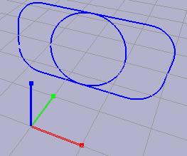
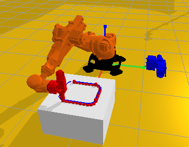
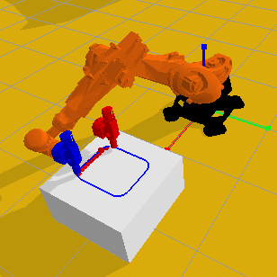

Tutorials
************

.. toctree::
   :hidden:

Path creation
======================

Generating paths
----------------------------
Paths are used frequently in pybullet industrial, e.g. for milling or 3d printing purposes.
There are a variety of options for creating a path that will be explained in this tutorial.

A path contains a 3-dimensional array with each dimension containing subsequent positions.
These data points can be specified or can be created automatically by using the built-in functions of pybullet industrial.

A box with rounded corners can be created by the use of build_box_path().

.. literalinclude:: ../../examples/path_creation.py
   :language: python
   :linenos:
   :lines: 1-3, 7-21
   
For positioning the path an array for the center position is specified along with the dimensions of the box and the radius of its corners.
The path is rotated by 90 degrees around the x-axis using the transformation function of pybullet. 
In this case, the path contains 100 points. A circle can be generated similarly. 
After the paths are created, they are drawn. The default color of a path is blue.
The result looks like this:

You can generate a path between two points by utilizing interpolation functions.
Here the color of the paths is prescribed.

.. literalinclude:: ../../examples/path_creation.py
   :language: python
   :linenos:
   :lines: 22-61

.. image:: images/path_interpolation.PNG
   :alt: interpolation_example

Manipulating paths
----------------------------
Sometimes it can be useful to translate an entire path by a given vector.
Similarly, you can rotate a path by a prescribed quaternion.
Finally, a path can be appended or prepended to another path, as shown here:
 
.. literalinclude:: ../../examples/path_creation.py
   :language: python
   :linenos:
   :lines: 62-69
   

3d printing and milling
======================
In this tutorial a robot prints and mills particles alternately.
To make a robot follow a path and print particles, the simulation must be set up first.

To integrate a robot into a simulation its URDF file must be loaded first.
Together with a position and an orientation, it can be loaded in the GUI.
For the extruder and the milling tool respectively properties must be defined as well.
For both the extruder and the remover a maximum distance, an opening angle, and the number of rays need to be specified.
With these parameters, the tool can determine whether other objects are close enough to interact with.
For the extruder, the material properties must be stated too.
By coupling or decoupling a tool to a link from the robot, it can be attached or detached.

.. literalinclude:: ../../examples/3d_printing_and_milling.py
   :language: python
   :linenos:
   :lines: 1-43
   
The next step is defining the path for the tools, as it is done here with a box path.

.. literalinclude:: ../../examples/3d_printing_and_milling.py
   :language: python
   :linenos:
   :lines: 46-49
   
   
Finally, the tools are translated to follow the path. 
First, they are positioned at the beginning of the path.
For each position in the path, the tools are translated and extrude or respectively remove particles.

After they reached the end of the path, the tool will be decoupled and the new tool coupled to the robot.

.. literalinclude:: ../../examples/3d_printing_and_milling.py
   :language: python
   :linenos:
   :lines: 59-88
